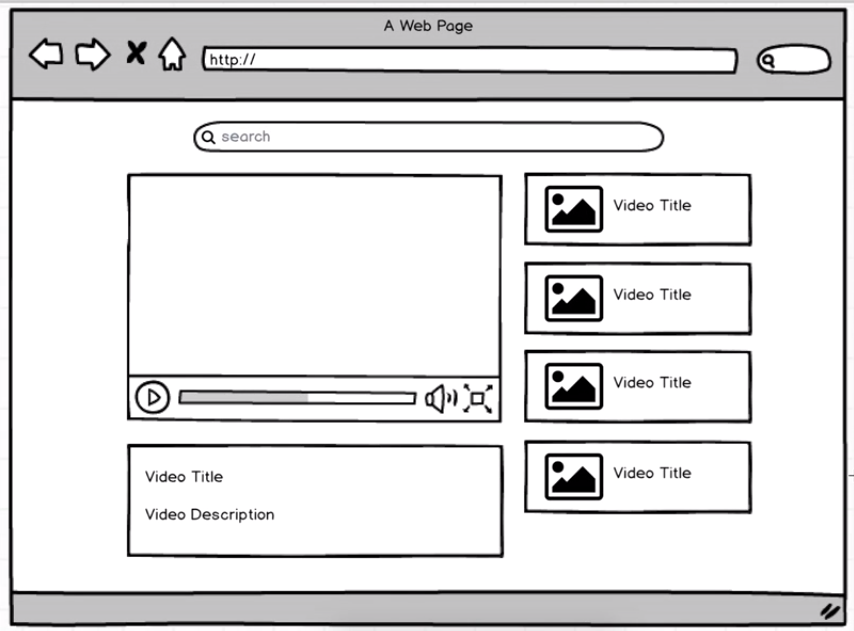

# ReTube

[](ReTube)


### Demo (plnkr)
https://next.plnkr.co/plunk/ms5soA9VmtwgHiRz


### Installation


Install the dependencies and devDependencies and start the server.

```sh
$ yarn install
$ yarn start
```


### Video Player Tutorial expected steps:

1 - :heavy_check_mark: Create empty react app, you can use create-react-app library

2 - :heavy_check_mark:  Build App, VideoList, VideoListItem, VideoPlayer, and   components at this point, we just need components with just dummy content to make sure everything is displayed on screen,App will contain all the components, except VideoListItem which is rendered inside VideoList

3 - :heavy_check_mark:  Register for youtube API and get a valid api_key,Save that api_key inside the App component, where api request is expected

4 - :heavy_check_mark:  Do a search request using 'fetch' with dummy search term, 'funny cats' for instance, Log response into console, and make sure you can see a list of videos in the response

5 - :heavy_check_mark:  Pass video list from App to VideoList, then to VideoListItem through a loop,list of videos should now appear

6 - :heavy_check_mark:  Pass first video from App to VideoPlayer, first video in the list should be displayed in the player

7 -:heavy_check_mark: Pass search term from SearchBar to App and use it to trigger a new search,as user types, video list and video player should be updated

8 -:heavy_check_mark: Pass selected video from VideoListItem to VideoList to App to VideoPlayer, as user selects a video, it is displayed inside the video player

9 - :heavy_check_mark:  import bootstrap css framework inside main index.html,make use of botstrap classes to improve display to match mockup as much as possible

